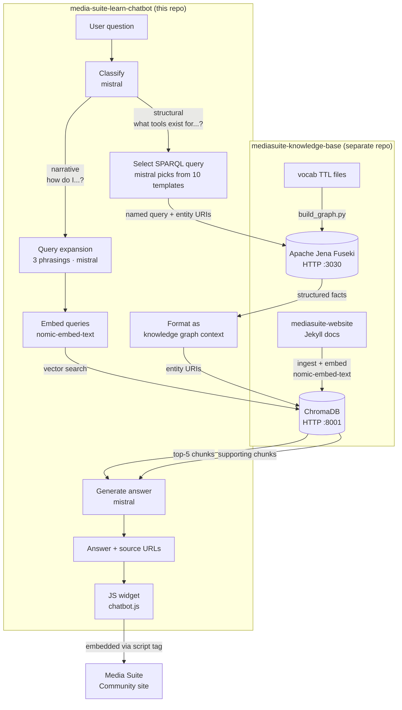

# Ask Media Suite

A RAG chatbot for researchers using the [CLARIAH Media Suite](https://mediasuite.clariah.nl). Ask questions in natural language and get answers grounded in the official Help, How-to, FAQ, Tutorial and Glossary content, with direct links back to the relevant pages.

The widget is intended to be embedded on the [Media Suite Community site](https://roelandordelman.github.io/media-suite-community/).

## Workflow

The chatbot routes questions to one of two retrieval paths depending on question type.



## Stack

| Layer | Technology |
|---|---|
| Generation, query expansion, classification | mistral via Ollama (local) |
| Embeddings | nomic-embed-text via Ollama (local) |
| Vector store | ChromaDB HTTP server — built in mediasuite-knowledge-base |
| Knowledge graph | Apache Jena Fuseki — built in mediasuite-knowledge-base |
| Backend | FastAPI + uvicorn |
| Frontend | Vanilla JS widget, no framework |

## Prerequisites

This repo is the **application layer only**. All ingestion, embedding, and knowledge graph infrastructure lives in [mediasuite-knowledge-base](https://github.com/roelandordelman/mediasuite-knowledge-base).

Before running this chatbot:

1. Clone and set up [mediasuite-knowledge-base](https://github.com/roelandordelman/mediasuite-knowledge-base) and follow its README to ingest the documentation, build the ChromaDB index, and load the knowledge graph into Fuseki.
2. Start the ChromaDB HTTP server (port 8001) and Apache Jena Fuseki (port 3030) from that repo.

## Setup

**1. Install dependencies**
```bash
pip install -r requirements.txt
```

**2. Install Ollama and pull models**

Download from [ollama.com/download](https://ollama.com/download), then:
```bash
ollama pull nomic-embed-text
ollama pull mistral
```

**3. Configure connections**

`config.yaml` is pre-configured for local defaults. Edit if your ChromaDB or Fuseki run on different hosts or ports:
```yaml
knowledge_base:
  chroma_host: localhost
  chroma_port: 8001

knowledge_graph:
  fuseki_url: http://localhost:3030
  dataset: mediasuite
```

**4. Start the API**
```bash
uvicorn api.main:app --reload
```

API at `http://localhost:8000`. Interactive docs at `http://localhost:8000/docs`.

**5. Test the widget**

Open `widget/chatbot.html` in a browser.

## Usage

**Ask a question via curl:**
```bash
curl -s -X POST http://localhost:8000/ask \
  -H "Content-Type: application/json" \
  -d '{"question": "Who can access the Media Suite?"}'
```

**Embed the widget on any page:**
```html
<script src="chatbot.js" data-api-url="https://your-api-url"></script>
```

## Project structure

```
api/
  main.py            — FastAPI app (POST /ask, conversation history)
  rag.py             — RAG pipeline: classify → retrieve → generate
  router.py          — Retrieval router: classify + SPARQL selection + result formatting
  sparql_queries.py  — Named SPARQL query library (10 templates) + run_query()
widget/              — Embeddable chat widget
evaluate/
  test_questions.yaml    — Narrative + structural eval questions
  eval_retrieval.py      — Narrative retrieval eval (URL presence in top-5)
  eval_router.py         — Structural answer eval (key term scoring)
config.yaml          — ChromaDB + Fuseki config + entity/tool mappings
debug_rag.py         — Full pipeline debug CLI
query_debug.py       — Retrieval-only debug CLI
```

## Evaluation

```bash
python evaluate/eval_retrieval.py           # narrative questions: 7/7 (100%)
python evaluate/eval_router.py              # structural questions
python evaluate/eval_router.py --verbose    # show full answers on failure
```

**Narrative retrieval** (7 questions): consistently 7/7. Checks whether any expected URL appears in the top-5 retrieved chunks.

**Structural routing** (10 questions): ~3–5/10 with mistral 7B. Checks whether key entities from the expected answer appear in the generated text.

## Debugging

```bash
python3 debug_rag.py "your question here"
python3 debug_rag.py "your question here" --no-generate  # retrieval only
python3 query_debug.py "your question here" --top-k 10
```

`debug_rag.py` shows the full pipeline: query classification, expanded variants, retrieved chunks with scores, the exact context string passed to the LLM, and the generated answer.

`query_debug.py` shows retrieved chunks with similarity scores and source URLs — useful for diagnosing why a question isn't finding the right content.

## Known limitations

**SPARQL generation with mistral 7B**: the structural path uses mistral to select a named query template from a pre-written library (`api/sparql_queries.py`). This is far more reliable than generating SPARQL from scratch, but mistral is inconsistent — it sometimes ignores the SPARQL context when generating the final answer, particularly for complex structural questions. A better model (llama3, GPT-4o, Claude) would significantly improve structural answer quality without any code changes.

**Vocabulary mismatch**: questions using acronyms ("SANE") or branded names ("VisXP") embed differently from the documentation vocabulary. The descriptive form ("secure analysis environment for sensitive audiovisual data") retrieves correctly where the acronym fails. Query expansion mitigates this for narrative questions.
