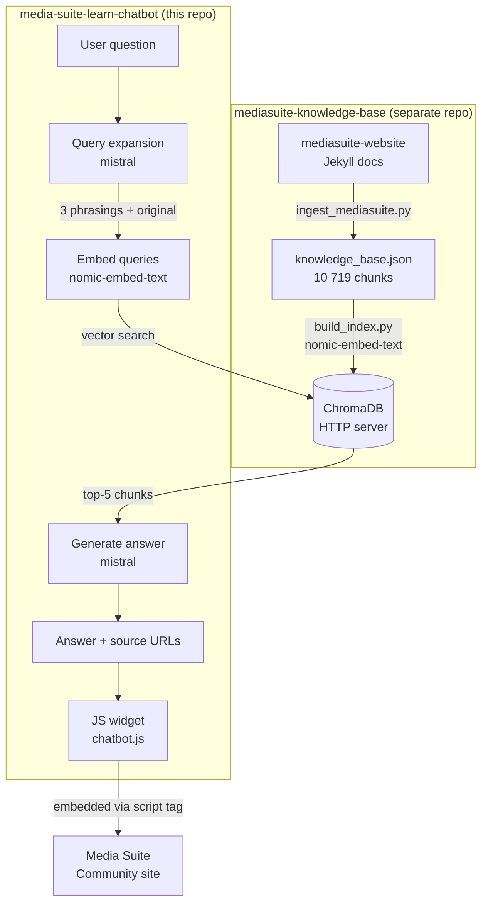

# Ask Media Suite

A RAG chatbot for researchers using the [CLARIAH Media Suite](https://mediasuite.clariah.nl). Ask questions in natural language and get answers grounded in the official Help, How-to, FAQ, Tutorial and Glossary content, with direct links back to the relevant pages.

The widget is intended to be embedded on the [Media Suite Community site](https://roelandordelman.github.io/media-suite-community/).

## Workflow



## Stack

| Layer | Technology |
|---|---|
| Generation + query expansion | mistral via Ollama (local) |
| Embeddings | nomic-embed-text via Ollama (local) |
| Vector store | ChromaDB HTTP server (mediasuite-knowledge-base) |
| Backend | FastAPI + uvicorn |
| Frontend | Vanilla JS widget, no framework |

## Prerequisites

This repo is the **application layer only**. All ingestion, embedding and vector store infrastructure lives in [mediasuite-knowledge-base](https://github.com/roelandordelman/mediasuite-knowledge-base).

Before running this chatbot:

1. Clone and set up [mediasuite-knowledge-base](https://github.com/roelandordelman/mediasuite-knowledge-base) and follow its README to ingest the documentation and build the ChromaDB index.
2. Start the ChromaDB HTTP server from that repo (see its README for the command). By default it runs on port 8001 — make sure `config.yaml` in this repo matches.

## Setup

**1. Install dependencies**
```bash
pip install -r requirements.txt
```

**2. Install Ollama and pull models**

Download from [ollama.com/download](https://ollama.com/download), then:
```bash
ollama pull nomic-embed-text
ollama pull mistral
```

**3. Configure the knowledge base connection**

Edit `config.yaml` to match your ChromaDB HTTP server:
```yaml
knowledge_base:
  collection_name: mediasuite
  chroma_host: localhost
  chroma_port: 8001
```

**4. Start the API**
```bash
uvicorn api.main:app --reload
```

The API is available at `http://localhost:8000`. Interactive docs at `http://localhost:8000/docs`.

**5. Test the widget**

Open `widget/chatbot.html` in a browser.

## Usage

**Ask a question via curl:**
```bash
curl -s -X POST http://localhost:8000/ask \
  -H "Content-Type: application/json" \
  -d '{"question": "Who can access the Media Suite?"}'
```

**Embed the widget on any page:**
```html
<script src="chatbot.js" data-api-url="https://your-api-url"></script>
```

## Project structure

```
api/            — FastAPI app (main.py, rag.py)
widget/         — chat widget (chatbot.js, chatbot.html)
config.yaml     — knowledge base connection config (host, port, collection)
query_debug.py  — CLI tool to inspect retrieved chunks for a query
```

## Debugging retrieval

```bash
python3 query_debug.py "your question here"
python3 query_debug.py "your question here" --top-k 10
```

Shows expanded query variants, retrieved chunks with similarity scores, content type, and source URLs — useful for diagnosing why a question isn't finding the right content.
