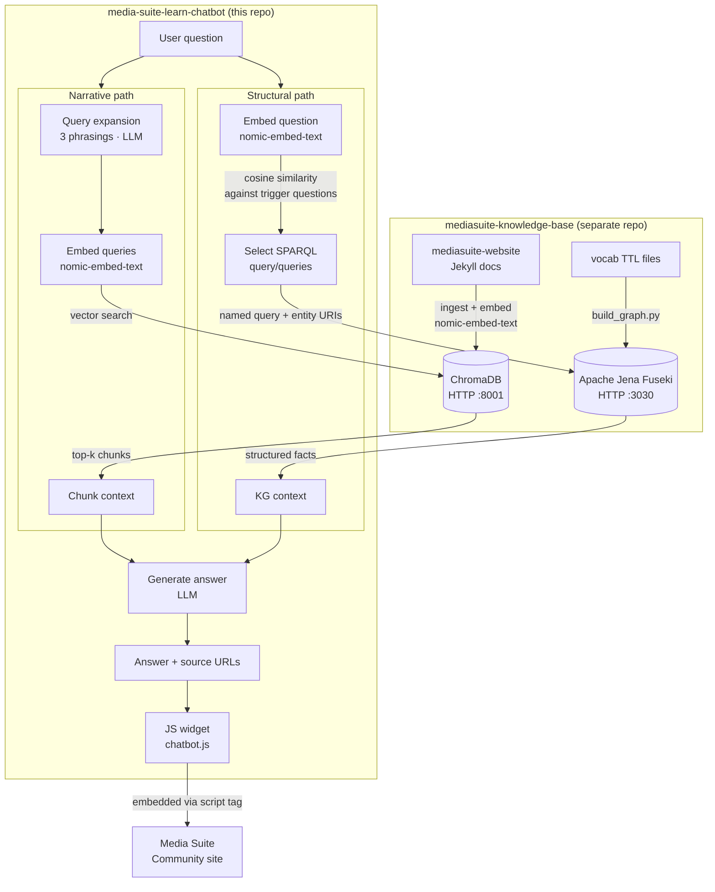

# Ask Media Suite

A RAG chatbot for researchers using the [CLARIAH Media Suite](https://mediasuite.clariah.nl). Ask questions in natural language and get answers grounded in the official Help, How-to, FAQ, Tutorial and Glossary content, with direct links back to the relevant pages.

The widget is intended to be embedded on the [Media Suite Community site](https://roelandordelman.github.io/media-suite-community/).

## Architecture

The chatbot routes questions to one of two retrieval paths depending on question type.



Both paths run in parallel for every question. The LLM is used only for query expansion and answer generation — not for routing decisions.

## Stack

| Layer | Technology |
|---|---|
| Generation, query expansion | llama3.1:8b via Ollama (local) |
| Embeddings | nomic-embed-text via Ollama (local) |
| Vector store | ChromaDB HTTP server — built in mediasuite-knowledge-base |
| Knowledge graph | Apache Jena Fuseki — built in mediasuite-knowledge-base |
| Backend | FastAPI + uvicorn |
| Frontend | Vanilla JS widget, no framework |

## Design decisions

### Why a named-query catalogue instead of LLM-generated SPARQL

The structural path does not ask the LLM to write SPARQL. Instead it maintains a catalogue of pre-written, tested query templates (`api/sparql_queries.py`) and routes incoming questions to the right template.

**Why not generate SPARQL from natural language?**

Writing valid SPARQL requires knowing two things:
- *Schema*: the exact vocabulary in use (`clariah:ComponentTool`, `tadirah:audioAnnotation`, `schema:releaseNotes`, …). LLMs hallucinate property names they haven't seen.
- *Content*: which fields are actually populated in the graph. A syntactically valid query can return zero rows because it references a property that only some entities have. The named queries are written and tested against the actual data, so their return shape is known.

**The set-of-variants insight**

One named query covers an entire *class* of natural language questions. `tools_by_activity` answers "what tools support searching?", "what tools support annotation?", "what tools support data visualisation?" — all phrasings map to the same template, just with a different URI parameter. This is the key leverage: a small, well-tested catalogue covers a large question space without requiring a model that can reliably generate arbitrary SPARQL.

**Routing as a matching problem, not a generation problem**

Selecting the right named query is a *matching* problem (which of these 10 templates fits the question?), not a generation problem (write valid SPARQL from scratch). Matching is solved with embedding similarity — embed the question, compare against pre-written trigger questions for each template, pick the closest. This is deterministic and does not degrade with model quality.

Early versions of this chatbot used an LLM to both classify questions (structural vs narrative) and select SPARQL queries. This was non-deterministic: the same question could route differently between runs, and the LLM sometimes hallucinated unresolvable template variables. Replacing LLM routing with embedding similarity is the planned improvement (see [Planned improvements](#planned-improvements)).

### Why two parallel paths

Early versions classified each question as either structural or narrative before retrieval. Classification added latency and a failure mode: questions classified as narrative never reached the graph, even when the graph held the authoritative answer.

Running both paths in parallel removes this failure mode. The LLM generates an answer from whatever context both paths returned — structured facts from the graph and/or text chunks from ChromaDB. If the structural path returns nothing relevant (the query catalogue has no match above threshold), only the narrative context is used, and vice versa.

## Prerequisites

This repo is the **application layer only**. All ingestion, embedding, and knowledge graph infrastructure lives in [mediasuite-knowledge-base](https://github.com/roelandordelman/mediasuite-knowledge-base).

Before running this chatbot:

1. Clone and set up [mediasuite-knowledge-base](https://github.com/roelandordelman/mediasuite-knowledge-base) and follow its README to ingest the documentation, build the ChromaDB index, and load the knowledge graph into Fuseki.
2. Start the ChromaDB HTTP server (port 8001) and Apache Jena Fuseki (port 3030) from that repo.

## Setup

**1. Install dependencies**
```bash
pip install -r requirements.txt
```

**2. Install Ollama and pull models**

Download from [ollama.com/download](https://ollama.com/download), then:
```bash
ollama pull nomic-embed-text
ollama pull llama3.1:8b
```

**3. Configure connections**

`config.yaml` is pre-configured for local defaults. Edit if your ChromaDB or Fuseki run on different hosts or ports:
```yaml
knowledge_base:
  chroma_host: localhost
  chroma_port: 8001

knowledge_graph:
  fuseki_url: http://localhost:3030
  dataset: mediasuite
```

**4. Start the API**
```bash
uvicorn api.main:app --reload
```

API at `http://localhost:8000`. Interactive docs at `http://localhost:8000/docs`.

**5. Test the widget**

Open `widget/chatbot.html` in a browser.

## Usage

**Ask a question via curl:**
```bash
curl -s -X POST http://localhost:8000/ask \
  -H "Content-Type: application/json" \
  -d '{"question": "Who can access the Media Suite?"}'
```

**Embed the widget on any page:**
```html
<script src="chatbot.js" data-api-url="https://your-api-url"></script>
```

## Project structure

```
api/
  main.py            — FastAPI app (POST /ask, conversation history)
  rag.py             — RAG pipeline: expand → retrieve → generate (both paths)
  router.py          — Structural path: SPARQL query selection + result formatting
  sparql_queries.py  — Named SPARQL query catalogue (10 templates) + run_query()
widget/              — Embeddable chat widget
evaluate/
  test_questions.yaml    — Eval questions (narrative + structural, annotated + pending)
  eval_retrieval.py      — Narrative retrieval eval (URL presence in top-k)
  eval_router.py         — Structural answer eval (key term scoring, debug mode)
config.yaml          — ChromaDB + Fuseki config + entity/tool/collection mappings
debug_rag.py         — Full pipeline debug CLI
query_debug.py       — Retrieval-only debug CLI
```

## Evaluation

```bash
python evaluate/eval_retrieval.py              # narrative questions: URL presence in top-k
python evaluate/eval_retrieval.py --verbose    # show retrieved vs expected URLs on failure
python evaluate/eval_router.py                 # structural questions: key term scoring
python evaluate/eval_router.py --debug         # show route, SPARQL queries, context per question
python evaluate/eval_router.py --verbose       # show full answers and missing terms on failure
```

**Narrative retrieval** (7 annotated questions): consistently 7/7. Checks whether any expected URL appears in the top-k retrieved chunks.

**Structural routing** (10 annotated questions): 7–9/10 depending on run (model non-determinism). Checks whether key entity names from the expected answer appear in the generated text. The `--debug` flag shows per-question what route was taken, which SPARQL queries were selected, and what context was built — useful for diagnosing failures.

Questions marked `annotated: false` in `test_questions.yaml` are shown as `[PENDING]` with the chatbot's actual output, making it easy to review and annotate them.

## Debugging

```bash
python3 debug_rag.py "your question here"
python3 debug_rag.py "your question here" --no-generate  # retrieval only
python3 query_debug.py "your question here" --top-k 10
```

`debug_rag.py` shows the full pipeline: query classification, expanded variants, retrieved chunks with scores, the exact context string passed to the LLM, and the generated answer.

`query_debug.py` shows retrieved chunks with similarity scores and source URLs — useful for diagnosing why a question isn't finding the right content.

## Planned improvements

**Embedding-based SPARQL routing** (replaces current LLM-based routing)

The current implementation still uses an LLM to select named queries and fill URI parameters. This is non-deterministic: the same question routes differently between runs. The planned replacement:

1. For each named query, define a set of trigger questions that it answers.
2. At query time, embed the user question with nomic-embed-text and compute cosine similarity against all trigger questions.
3. Run queries whose best trigger similarity exceeds a threshold — no LLM call needed.
4. For parametric queries, fill URI parameters by embedding similarity against known entity names from `config.yaml` (tool names, workflow names, collection names, tadirah activity labels).

This makes routing fully deterministic and removes all LLM dependency from the retrieval decision.

**Expanded query catalogue**

Each new named query covers an entire class of natural language questions. Candidates for addition:
- `collections_by_license_type` — filter by CC0 / CC-BY / Public Domain specifically
- `restricted_collections` — collections requiring institutional login
- `workflows_by_status` — filter by Fully supported / Aspirational / Partially supported
- `tools_for_workflow` — inverse of `workflows_by_tool`

## Conversational search

The current implementation is single-turn: each question is answered independently
without memory of previous questions. The planned conversational extension adds
three capabilities:

**History-aware query reformulation** — before embedding, the question is rewritten
as a standalone query using conversation history. This handles follow-up questions
like "what about for radio?" which are meaningless without context.

**Retrieval confidence scoring** — after retrieval, the system evaluates whether
the returned chunks actually answer the question. If confidence is low, it asks
the researcher a targeted clarifying question rather than generating a weak answer.

**Proactive follow-up suggestions** — after a successful answer, the system
suggests 2-3 related questions a researcher might naturally ask next. Particularly
useful for researchers who don't yet know what the Media Suite can do.

These are implemented as additions to `api/rag.py` and `api/main.py` — the
architecture does not change, conversation history is passed as additional context
with each request.


## Known limitations

**Model non-determinism**: the structural path currently uses an LLM to select SPARQL query templates. The same question can route differently between runs. The planned embedding-based routing (see above) eliminates this.

**Vocabulary mismatch**: questions using acronyms ("SANE") or branded names ("VisXP") embed differently from the documentation vocabulary. Query expansion mitigates this for the narrative path.

**Query catalogue coverage**: the structural path can only answer questions that map to one of the named queries. Questions about graph relationships not covered by the catalogue fall back to vector search.
