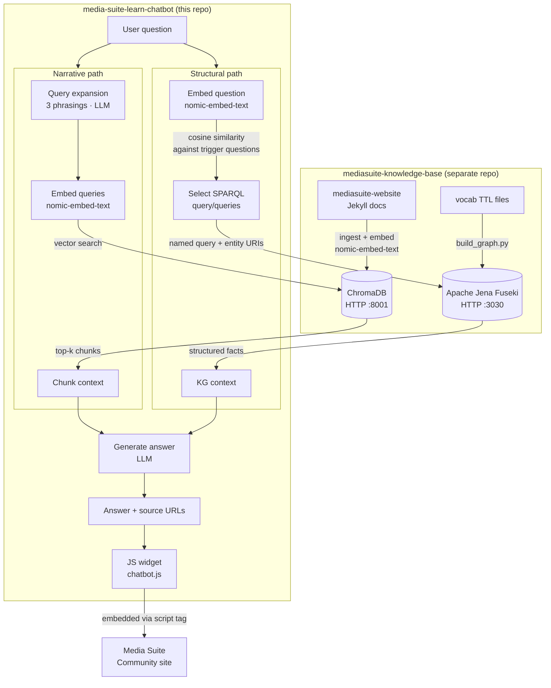

# Ask Media Suite

A RAG chatbot for researchers using the [CLARIAH Media Suite](https://mediasuite.clariah.nl). Ask questions in natural language and get answers grounded in the official Help, How-to, FAQ, Tutorial and Glossary content, with direct links back to the relevant pages.

The widget is intended to be embedded on the [Media Suite Community site](https://roelandordelman.github.io/media-suite-community/).

## Architecture

The chatbot routes questions to one of two retrieval paths depending on question type.



Both paths run in parallel for every question. The LLM is used only for query expansion and answer generation — not for routing decisions.

## Stack

| Layer | Technology |
|---|---|
| Generation, query expansion | llama3.1:8b via Ollama (local) |
| Embeddings | nomic-embed-text via Ollama (local) |
| Vector store | ChromaDB HTTP server — built in mediasuite-knowledge-base |
| Knowledge graph | Apache Jena Fuseki — built in mediasuite-knowledge-base |
| Backend | FastAPI + uvicorn |
| Frontend | Vanilla JS widget, no framework |

## Design decisions

### Why a named-query catalogue instead of LLM-generated SPARQL

The structural path does not ask the LLM to write SPARQL. Instead it maintains a catalogue of pre-written, tested query templates (`api/sparql_queries.py`) and routes incoming questions to the right template.

**Why not generate SPARQL from natural language?**

Writing valid SPARQL requires knowing two things:
- *Schema*: the exact vocabulary in use (`clariah:ComponentTool`, `tadirah:audioAnnotation`, `schema:releaseNotes`, …). LLMs hallucinate property names they haven't seen.
- *Content*: which fields are actually populated in the graph. A syntactically valid query can return zero rows because it references a property that only some entities have. The named queries are written and tested against the actual data, so their return shape is known.

**The set-of-variants insight**

One named query covers an entire *class* of natural language questions. `tools_by_activity` answers "what tools support searching?", "what tools support annotation?", "what tools support data visualisation?" — all phrasings map to the same template, just with a different URI parameter. This is the key leverage: a small, well-tested catalogue covers a large question space without requiring a model that can reliably generate arbitrary SPARQL.

**Routing as a matching problem, not a generation problem**

Selecting the right named query is a *matching* problem (which of these 10 templates fits the question?), not a generation problem (write valid SPARQL from scratch). Matching is solved with embedding similarity — embed the question, compare against pre-written trigger questions for each template, pick the closest. This is deterministic and does not degrade with model quality.

Early versions of this chatbot used an LLM to both classify questions (structural vs narrative) and select SPARQL queries. This was non-deterministic: the same question could route differently between runs, and the LLM sometimes hallucinated unresolvable template variables. This has been replaced with the embedding-based `QueryIndex` (see `api/query_index.py`).

### Why two parallel paths

Early versions classified each question as either structural or narrative before retrieval. Classification added latency and a failure mode: questions classified as narrative never reached the graph, even when the graph held the authoritative answer.

Running both paths in parallel removes this failure mode. The LLM generates an answer from whatever context both paths returned — structured facts from the graph and/or text chunks from ChromaDB. If the structural path returns nothing relevant (the query catalogue has no match above threshold), only the narrative context is used, and vice versa.

## Prerequisites

This repo is the **application layer only**. All ingestion, embedding, and knowledge graph infrastructure lives in [mediasuite-knowledge-base](https://github.com/roelandordelman/mediasuite-knowledge-base).

Before running this chatbot:

1. Clone and set up [mediasuite-knowledge-base](https://github.com/roelandordelman/mediasuite-knowledge-base) and follow its README to ingest the documentation, build the ChromaDB index, and load the knowledge graph into Fuseki.
2. Start the ChromaDB HTTP server (port 8001) and Apache Jena Fuseki (port 3030) from that repo.

## Setup

**1. Install dependencies**
```bash
pip install -r requirements.txt
```

**2. Install Ollama and pull models**

Download from [ollama.com/download](https://ollama.com/download), then:
```bash
ollama pull nomic-embed-text
ollama pull llama3.1:8b
```

**3. Configure connections**

`config.yaml` is pre-configured for local defaults. Edit if your ChromaDB or Fuseki run on different hosts or ports:
```yaml
knowledge_base:
  chroma_host: localhost
  chroma_port: 8001

knowledge_graph:
  fuseki_url: http://localhost:3030
  dataset: mediasuite
```

**4. Start the API**
```bash
uvicorn api.main:app --reload
```

API at `http://localhost:8000`. Interactive docs at `http://localhost:8000/docs`.

**5. Test the widget**

Open `widget/chatbot.html` in a browser.

## Usage

**Ask a question via curl:**
```bash
curl -s -X POST http://localhost:8000/ask \
  -H "Content-Type: application/json" \
  -d '{"question": "Who can access the Media Suite?"}'
```

**Embed the widget on any page:**
```html
<script src="chatbot.js" data-api-url="https://your-api-url"></script>
```

## Project structure

```
api/
  main.py            — FastAPI app (POST /ask, conversation history)
  rag.py             — RAG pipeline: both paths always run → generate
  router.py          — Structural path: SPARQL execution + result formatting
  query_index.py     — QueryIndex singleton: trigger embeddings, named-entity detection
  sparql_queries.py  — Named SPARQL query catalogue (11 templates) + run_query()
widget/              — Embeddable chat widget
evaluate/
  test_questions.yaml    — Eval questions (narrative + structural, annotated + pending)
  eval_retrieval.py      — Narrative retrieval eval (URL presence in top-k)
  eval_router.py         — Structural answer eval (key term scoring, debug mode)
config.yaml          — ChromaDB + Fuseki config + entity/tool/collection mappings
debug_rag.py         — Full pipeline debug CLI
query_debug.py       — Retrieval-only debug CLI
```

## Evaluation

```bash
python evaluate/eval_retrieval.py              # narrative questions: URL presence in top-k
python evaluate/eval_retrieval.py --verbose    # show retrieved vs expected URLs on failure
python evaluate/eval_router.py                 # structural questions: key term scoring
python evaluate/eval_router.py --debug         # show route, SPARQL queries, context per question
python evaluate/eval_router.py --verbose       # show full answers and missing terms on failure
```

**Narrative retrieval** (14 annotated questions): consistently 14/14. Checks whether any expected URL appears in the top-k retrieved chunks.

**Structural routing** (26 annotated questions): typically 25–26/26. Routing is fully deterministic; occasional failures are LLM non-determinism in answer generation (~1 per run at 50% key-term threshold). The `--debug` flag shows which SPARQL queries were selected, what context was built, and which entity URIs were passed to ChromaDB — useful for diagnosing failures.

Questions marked `annotated: false` in `test_questions.yaml` are shown as `[PENDING]` with the chatbot's actual output, making it easy to review and annotate them.

## Debugging

```bash
python3 debug_rag.py "your question here"
python3 debug_rag.py "your question here" --no-generate  # retrieval only
python3 query_debug.py "your question here" --top-k 10
```

`debug_rag.py` shows the full pipeline: expanded query variants, SPARQL queries selected, retrieved chunks with scores, the exact context string passed to the LLM, and the generated answer.

`query_debug.py` shows retrieved chunks with similarity scores and source URLs — useful for diagnosing why a question isn't finding the right content.

## Known limitations and planned improvements

**Query catalogue coverage**: the structural path can only answer questions that map to one of the 11 named queries. Questions about graph relationships not yet in the catalogue fall back to vector search. Candidates for addition: `workflows_by_status`, `tools_for_workflow`, `collections_by_license_type`.

**Vocabulary mismatch**: questions using acronyms ("SANE") or non-standard phrasing embed differently from documentation vocabulary. Query expansion mitigates this for the narrative path; title overrides help on the KB side.

**LLM non-determinism in generation**: routing is deterministic but the LLM occasionally omits expected terms from answers when multiple pieces of context compete (~1 failure per eval run at 50% key-term threshold). Not a routing problem.

**Conversational search**: conversation history is passed to the LLM for generation, and follow-up questions are rewritten as standalone queries before embedding (`_rewrite_as_standalone()` — fires only when a pronoun/demonstrative is detected). Remaining: retrieval confidence scoring (ask a clarifying question rather than generating a weak answer) and proactive follow-up suggestions.

**Agentic RAG**: CRAG is implemented — if the structural path returns nothing and narrative retrieval is weak (best L2 distance > 0.75), the pipeline reformulates the question with different vocabulary and retries once, merging results. Next stages: hybrid routing (standard pipeline for simple questions, ReAct for complex) → full ReAct agent. See [docs/agentic_rag.md](docs/agentic_rag.md) and the [project roadmap](https://github.com/roelandordelman/mediasuite-knowledge-base/blob/main/docs/roadmap.md).
